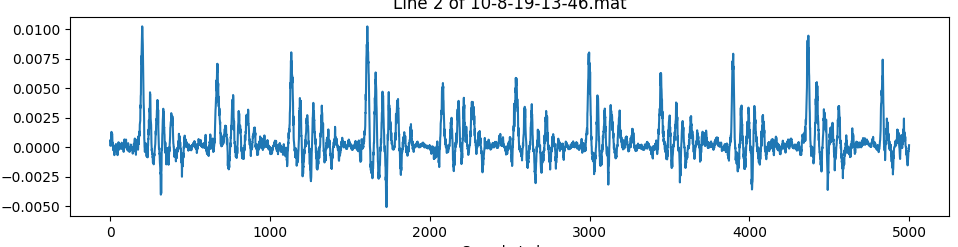
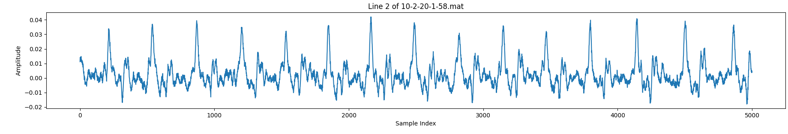

# 噪音采集方案
## 1. 采集方案——佩戴采集姿势补充（对比原始采集方案优化补充）
1. 对于不同耳洞大小的采集用户，使用不同大小的耳塞，可以一定程度增强采集数据的稳定性。目前实验设备中建议耳洞小的使用红白色小号耳塞，耳洞大的使用绿白色大号耳塞。合适大小的耳塞可以确保噪音传感器能够紧密贴合耳道，避免数据因耳塞松动造成的波动。
2. 采集过程中，用户应确保耳塞与耳道的贴合度，避免耳塞松动或滑动，因为这会直接影响采集数据的质量。若耳塞过松，数据可能会呈现如图1所示的从强到弱的类正弦波振动，这种波动主要是由耳塞松动引发的物理抖动，导致传感器接收到的信号不稳定。反之，佩戴紧密的数据则较为平滑和稳定，波形干净，如图2所示。

图1. 佩戴不紧时采集到的数据存在一些振动信号
  

图2. 佩戴紧密时采集到的较好数据样例

3. 由于每个人的耳道结构不同，采集到清晰且具有明显周期性的数据时，所需的佩戴位置会有所差异。最终的佩戴姿势应以能够在实时窗口中稳定产生数据为准。

## 2. 数据采集计划
计划一次采集10s噪音信号，噪音分为如下几类：
**1. 刷手机视频**
**2. 走路**
**3. 摇头**
**4. 咀嚼**
佩戴耳机时进行的这些日常活动，如刷视频、走路、抖腿、咀嚼，均会产生不同类型的噪音。通过对这些场景下的噪音数据采集，通过后期训练去除噪音。

目前暂定每条采集10s数据。采集6个对象。每种噪音采集30条。共4*6*30=720条数据。共7200s。