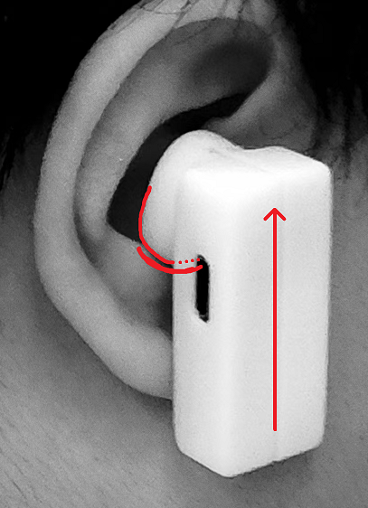
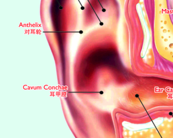
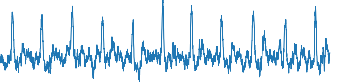
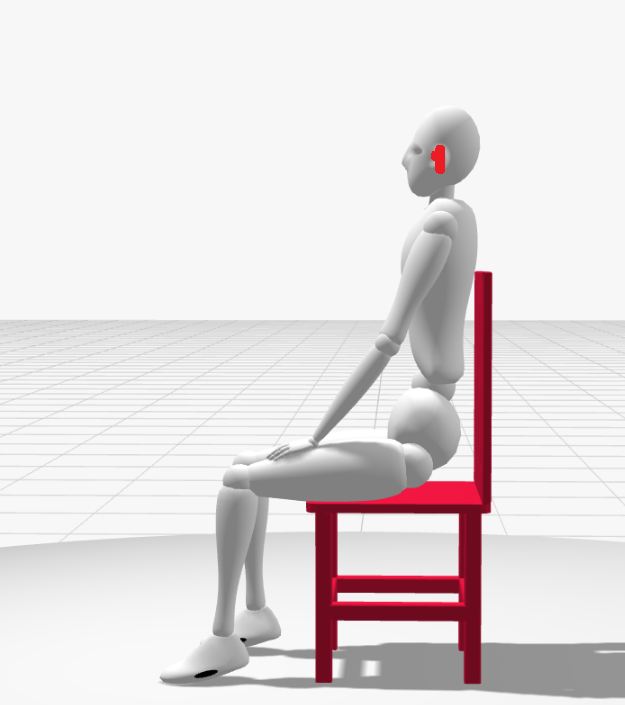

# 采集方案

一、佩戴方式和采集坐姿



图一耳机佩戴方式



图二耳甲腔示意图

如图一所示，佩戴时统一保证：耳机外部结构垂直于地面，耳机人体工学部分置于耳甲腔。通过微调，获得如图三类似的x轴清晰的数据。



图三位于x的清晰数据

如图三所示，通过调整耳机位置，使得x轴数据清晰，y轴和z轴数据尽量小。通过这种方式，可以保证数据的准确性。



图四采集姿势

如图四所示，采集时，保持坐姿，头部保持平稳。通过这种方式，可以获得较为稳定的x轴数据。

二、数据采集

**1. 数据采集时，保持佩戴方式和采集姿势不变，连接耳机，打开数据采集软件，开始采集数据。**

**2. 观察波形，当存在10s不重合的良好数据时，按下采集键，保存一条前10s数据。**

**3. 计划初步采集10个人的数据，每个人采集60条数据，共计600条，6000s数据。**

三、数据验证

**通过如下程序读取一组采集数据的全部情况，检查是否存在异常数据。**

```py
import scipy.io as sio

import os

import matplotlib.pyplot as plt

from scipy.ndimage import gaussian_filter

# 指定要读取的文件夹路径

folder_path = r"collect_data\device3\\p4-test\\1\scg" # folder_path = r"quiet"

# 遍历文件夹中的所有文件

for file_name in os.listdir(folder_path):

# 检查是否为.mat文件

if file_name.endswith(".mat"):

file_path = os.path.join(folder_path, file_name) print(f"\nReading file: {file_name}")

# 读取.mat文件

data = sio.loadmat(file_path)

# 输出.mat文件的属性

print("Keys in .mat file:", data.keys())

# 如果存在"accresult"键，则输出它的形状并绘制3条数据 (line 2-4) if"accresult"in data:

accresult = data["accresult"]

print("Shape of 'accresult':", accresult.shape)

# 检查 accresult 的形状是否是 (4, N)

if accresult.shape[0] == 4and1000 < accresult.shape[1] < 500000: # 创建一个新的图形窗口

fig, axs = plt.subplots(3, 1, figsize=(10, 8))

# 绘制 line 2-4

for i in range(1, 4):

acc0 = 0-accresult[i]

axs[i-1].plot(acc0)

axs[i-1].set_title(f'Line {i+1} of {file_name}')

axs[i-1].set_xlabel('Sample Index')

axs[i-1].set_ylabel('Amplitude')

# 调整布局

plt.tight_layout()

plt.show()

else:

print(f"'accresult' does not have the expected shape (4, N) in file {file_name}")

else:

print(f"'accresult' not found in the file {file_name}")
```